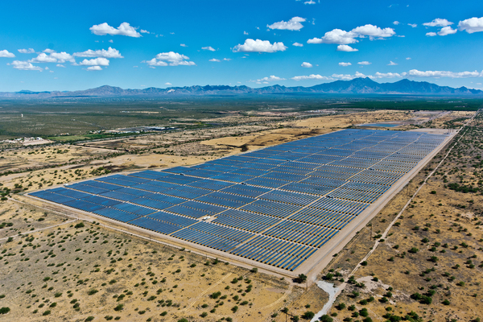
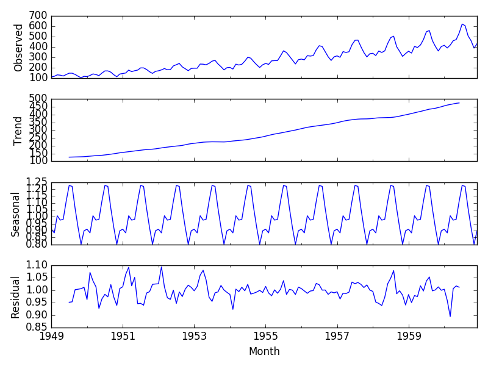

# [Expert, Time-series] 태양열 발전소에 들어오는 총 태양광 에너지 예측
---

## Introduction

태양광 발전 시스템은 무공해, 무연료의 태양열을 직접 전기 에너지로 변환하는 시스템입니다. 태양열과 풍력과 같은 재생 가능한 에너지원은 화석 연료에 비해 많은 환경적 이점을 제공하고 들어오는 태양광 에너지가 높을 때, 저렴한 비용으로 전기를 제공해줄 수 있습니다. 하지만, 기상 조건, 발전소의 위도, 시간 등 다양한 환경 요인들의 변화에 따른 변동폭이 크기 때문에 기존 화석 연료도 같이 사용합니다.

유틸리티 회사 *EnergyX*는 태양광 에너지 공급과 화석 연료 공급의 적절한 균형을 유지하기 위해 정확한 태양 에너지 생산 예측을 필요로 합니다. 예측 오류는 과도한 연료 소비를 초래하거나 인근 유틸리티에서 전기를 긴급 구매해야 하기 때문에 회사에 막대한 비용을 초래할 수 있기 때문입니다. 

일반적인 전력 예측은 수치 기상 예측 모델에서 파생되지만, 통계 및 머신 러닝 기술이 수치 모델과 함께 더 정확한 예측을 수행하는 데 사용됩니다. 현재 EnergyX는 ARIMA 기반 통계 기법을 사용하지만, 고도화된 머신 러닝 기법에도 관심이 있기 때문에 American Meteorological Society(AMS)와 협력하여 여러분의 팀에 샘플 데이터를 제공했습니다.

## Mission
팀의 목표는 Amazon Forecast나 Amazon SageMaker를 활용하여 태양광 에너지 예측 모델을 훈련하고 배포하는 것입니다.

### 팀원 및 추천 서비스
- 데이터 이해 및 전처리가 필요하기 때문에, 팀원 중 적어도 1명은 프로젝트 경험이 있는 데이터 과학자나 머신 러닝 엔지니어가 포함되어야 합니다.
- 만약 Amazon Forecast 및 시계열 데이터에 대한 기본적인 이해가 필요하면 아래 핸즈온들을 먼저 참조해 주세요.
- 추천 서비스
    - Amazon Forecast
    - Amazon SageMaker Built-in Models (XGBoost, DeepAR, Linear Learner 등)
    - Amazon SageMaker BYOM(Bring Your Own Model); Ensemble Model, GluonTS 등

## About the Dataset
본 데이터셋은 Kaggle의 **AMS 2013-2014 Solar Energy Prediction Contest**의 데이터셋과 동일하며 아래 웹사이트를 통해 다운로드받을 수 있습니다.
- https://www.kaggle.com/c/ams-2014-solar-energy-prediction-contest 

### Training set & Test set
- Training set: 1994년 1월 1일부터 2007년 12월 31일까지의 피쳐(feature) 및 정답(ground truth)
- Test set: 2008년 1월 1일부터 2012년 11월 30일까지의 피쳐(feature)

### Ground Truth
- CSV 포맷
- **solar_training_199401_200712.csv**: 1994년 1월 1일부터 운영되고 있는 오클라호마 Mesonet(http://www.mesonet.org/) 98곳 사이트에 들어오는 총 태양광 에너지로 5분마다 일사계로 직접 측정하고 일출부터 23:55 UTC 까지의 데이터를 모두 합산
    - Dimension: 5113 x 99 (5113일은 1994년 1월 1일부터 2007년 12월 31일까의 총 일수)
    - 1번째 컬럼은 datetime이며, 나머지 컬럼은 98곳 사이트에 대한 태양광 에너지 정답
    
### Features
- NetCDF4 포맷
- 훈련 파일 및 테스트 파일들은 각각 15개로 구성되어 있으며, 이름 규칙은 아래와 같습니다.
    - Training Dataset: **[Variable]_latlon_subset_19940101_20071231.nc**
    - Test Dataset: **[Variable]_latlon_subset_20080101_20121130.nc**

- 15개 피쳐에 대한 설명은 아래와 같습니다.

|Variable|	설명	| 단위
|---:|---:|---:|
|apcp_sfc|	3시간 동안 표면에 축적된 강수량|	kg m-2
|dlwrf_sfc|	표면에서 하향 장파 복사(long-wave radiative flux) 평균|	W m-2
|dswrf_sfc|	표면에서 하향 단파 복사(short-wave radiative flux) 평균|	W m-2
|pres_msl|	평균 해수면에서의 기압|	Pa
|pwat_eatm|	전체 대기 깊이에 걸쳐 침전 가능한 물|	kg m-2
|spfh_2m|	지상 2m의 특정 습도|	kg kg-1
|tcdc_eatm|	대기의 총 클라우드 커버|	 %
|tcolc_eatm|	전체 대기에 대한 총 컬럼 통합 응축수|	kg m-2
|tmax_2m|	지상 2미터에서 지난 3시간 동안의 최대 온도|	 K
|tmin_2m|	지상 2미터에서 지난 3시간 동안의 최저 온도|	 K
|tmp_2m|	지상 2미터에서의 현재 온도|	 K
|tmp_sfc|	 표면의 현재 온도|	 K
|ulwrf_sfc|	 표면에서의 상향 장파 복사|	 W m-2
|ulwrf_tatm| 대기에서의 상향 장파 복사|	 W m-2
|uswrf_sfc|	 표면에서의 상향 단파 복사|	 W m-2    

- Dimension: (5113 x 11 x 5 x 9 x 16)
    - 5113: timestamp(5,113일)
    - 11: 앙상블 피쳐(11종류의 기상 예보 피쳐)
    - 5: 측정 시간 단위로 12,15,18,21,24시에 총 5번의 예측을 수행
    - 9: GEFS 포인트의 위도
    - 16: GEFS 포인트의  경도

### Stations (Optional)
- CSV 포맷
- **station_info.csv**
- 98개 Mesonet station의 위도, 경도 및 고도(미터 단위)
    - stid: station id
    - nlat: 위도
    - elon: 경도
    - elev: 고도
- Dimension: (98 x 4)

#### GEFS 정보 (Optional)
- NetCDF4 포맷
- 훈련에 직접적으로 사용하지 않고 검증용으로 사용하는 GEFS 그리드 포인트 정보입니다. 
- **gefs_elevations.nc**

## Classical Time-series Forecasting

### Components of a Time series

시계열 데이터는(time-series)는 아래와 같은 성분들로 분해될 수 있으며, 덧셈 분해(additive decomposition)나 
곱셈 분해(multiplicative decomposition)를 사용합니다. 더 나은 기법들도 존재하고 급격한 증가나 감소에 대한 예측력이 부족하지만, 여전히 널리 사용되는 기법입니다.

* *추세(Trend)*: 장기적으로(long-run) 증가하거나 감소하는 흐름입니다.
* *계절성(Seasonality)*: 짧은 주기 내에서 반복적으로 동일 패턴으로 변동하는 숏텀(short-term) 주기입니다.
* *주기(Cycle)*: 고정된 빈도가 아닌 형태로 증가나 감소가 일어나는 모습(예: 경제 상황, 주식, 이자율 등)을 보일 때 나타납니다. 보통 자기상관(autocorrelation)으로 정의하기도 합니다.
* *잔차(Noise)*: 랜덤하게 변동하는 시계열 데이터입니다.

시계열의 관찰값(예: 들어오는 태양열 에너지 값)은 상기 구성 요소들의 조합일 수 있습니다. 다음의 합성 데이터를 예로 들어 보겠습니다. 관찰값은 추세, 계절성 및 일부 잔차로 분해됩니다. 추세와 계절성을 높은 정확도로 예측할 수 있지만 잔차는 예측하기 어렵습니다. 따라서, 잔차가 전체 관측 값의 주요 구성 요소가 아니라고 가정하는 것이 안전합니다 
과거 기업들은 ARIMA, ARIMAX, SARIMA, Spectral Analysis 및 Decomposition과 같은 통계 기술을 사용했으며 여전히 사용하고 있습니다. 이러한 기술은 단기 예측에 적합하지만 장기 예측이나 사용 가능한 데이터 volume이 큰 경우에는 효과적이지 않습니다. 예를 들어, ARIMA는 테스트셋의 즉각적인 데이터 포인트에 더 많은 가중치를 부여하지만
더 긴 시간 척도에 대한 예측값은 더 큰 분산을 예측할 수밖에 없습니다. 또한, 이러한 기술들은 시계열의 과거 데이터를 기반으로 하기 때문에, 기존 패턴이 미래에도 계속될 것이라는 가정이 들어갑니다. 이런 경우에는 RNN이나 시계열 데이터 모델링에 적합한 딥러닝 기술을 검토해 볼 수 있습니다.

## Get Started

### Starter Code
* [Starter Jupyter Notebook](Starter-Code/Solar-Energy-Prediction-Starter.ipynb)
* SageMaker DeepAR 예제: https://github.com/awslabs/amazon-sagemaker-examples/blob/master/introduction_to_amazon_algorithms/deepar_electricity/DeepAR-Electricity.ipynb 

### Tips

#### 문제 정의
문제를 단기 예측, 중기 예측, 장기 예측으로 각각 나눠서 접근해 보세요.
- 단기 예측 (24시간~72시간) - 전력 시스템 운영 및 제어
- 중기 예측 (1주~2주) - 태양 에너지 스케줄링
- 장기 예측 (수개월 이상) - 장기 태양 에너지 평가 및 발전소 유지보수 계획

#### Pre-processing
Kaggle에 등록된 컴피티션이지만, Starter Notebook이 없습니다. 따라서, 상기 Starter Notebook을 적극 활용해 주세요.
5-D 데이터를 그대로 활용하지 말고 적절한 형태의 2-D나 3-D로 변환하는 것이 좋습니다.

#### Modeling
처음부터 딥러닝 모델(RNN-variants, DeepAR, CNN-QR)로 훈련하는 것보다는 데이터 분포를 확인하고 로컬 상에서 기본적인 알고리즘으로 훈련을 수행한 후 baseline metric을 확인하는 것을 권장합니다. 시계열 데이터를 예측할 때 가장 기본적으로 사용하는 접근 방식들은 Naïve Forecasting, ETS(Exponential Smoothing; 지수 평활)와 ARIMA(Autoregressive integrated moving average; 자기회귀 통합 이동 평균)입니다. Naïve Forecasting은 가장 최근의 관측값을 예측값으로 사용하는 단순한 알고리즘이지만 계절성을 가지고 랜덤성이 강할 때 매우 유용합니다. ETS는 데이터가 강한 추세와 계절성을 가지고 있을 때 유용하고, ARIMA는 과거 데이터의 패턴과 유사할 때 유용합니다. 
모델링이 어렵다면 완전 관리형 AI 서비스인 Amazon Forecast도 검토해 보세요. (https://github.com/aws-samples/amazon-forecast-samples)

#### Deployment
Amazon SageMaker를 사용하신다면 수많은 배포(deployment) 핸즈온들이 있습니다. 아래 핸즈온들을 검토해 보세요.
배포 환경 구성이 어렵다면 완전 관리형 AI 서비스인 Amazon Forecast도 검토해 보세요. (https://github.com/aws-samples/amazon-forecast-samples)

### References
* https://www.kaggle.com/c/ams-2014-solar-energy-prediction-contest/data
* https://www.esrl.noaa.gov/psd/people/tom.hamill/SolarEnergyManuscript.pdf
* http://coronalenergy.com/utilities
* https://www.cnbc.com/2018/09/19/the-us-states-leading-the-way-in-solar.html
* https://www.8minutenergy.com (https://www.8minutenergy.com/)
* https://skymind.ai/wiki/lstm
* https://towardsdatascience.com/the-fall-of-rnn-lstm-2d1594c74ce0
* http://karpathy.github.io/2015/05/21/rnn-effectiveness/

