# [Intermediate, Computer Vision] Custom Object detection using Machine Learning on Amazon Sagemaker
---

## Introduction

배송 트래픽이 빠르게 증가하고 있습니다. 더 많은 선박들은 선박 사고, 불법 복제, 불법 어업, 마약 밀매 및 불법 화물 이동과 같은 해상 침해의 가능성을 증가시킵니다. 이로 인해, 환경 보호 기관에서 보험 회사 및 중앙 정부 기관에 이르기까지 많은 조직들이 넓은 바다를 면밀히 모니터링해야 합니다. Airbus(http://www.intelligence-airbusds.com/satellite-data/)는 광범위한 적용 범위, 세부 사항, 집중 모니터링, 프리미엄 반응성 및 해석 응답을 위한 의미있는 솔루션을 구축함으로써 포괄적인 해양 모니터링 서비스를 제공합니다. 

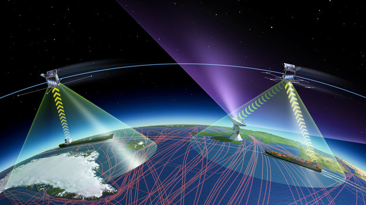

Airbus는 위성 이미지에서 배를 찾을 수 있도록 팀을 모집하고, 찾은 배 주변에 정렬된 경계 상자(bounding box) 세그먼트를 배치했습니다. Airbus는 자체 데이터 센터에서 온 프레미스에서 대부분의 분석 및 머신 러닝 작업을 수행하고 있지만, 모델 훈련 및 호스팅에 AWS SageMaker를 적극 검토하고 있으며, 자동화 솔루션에 관심이 많습니다. 여러분이 Airbus에 제공하는 PoC 모델이 성공적이라면 장기 프로젝트 계약까지 이끌어낼 수 있습니다.

## Mission

### Objective
팀의 목표는 Amazon Rekognition이나 Amazon SageMaker를 활용하여 선박 검출 모델을 훈련하고 배포하는 것입니다.

### 팀원 및 추천 서비스
- 팀원 중 적어도 1명은 컴퓨터 비전 프로젝트 경험이 있는 데이터 과학자나 머신 러닝 엔지니어가 포함되는 것을 권장하지만, 필수는 아닙니다.
- 추천 서비스
    - Amazon Rekognition
    - Amazon SageMaker BYOM(Bring Your Own Model); TensorFlow, PyTorch, MXNet

## About the Dataset

이 데이터셋은 머신 러닝을 통한 선박 감지에 중점을 둡니다. 이 데이터셋에는 유조선, 상업용 선박 또는 어선의 작은 이미지 데이터베이스가 포함되어 있습니다. 또한 실제 위성 이미지에서 선박 감지 알고리즘을 테스트하기 위해 1.5m 해상도의 대규모 SPOT 이미지가 포함되어 있습니다.

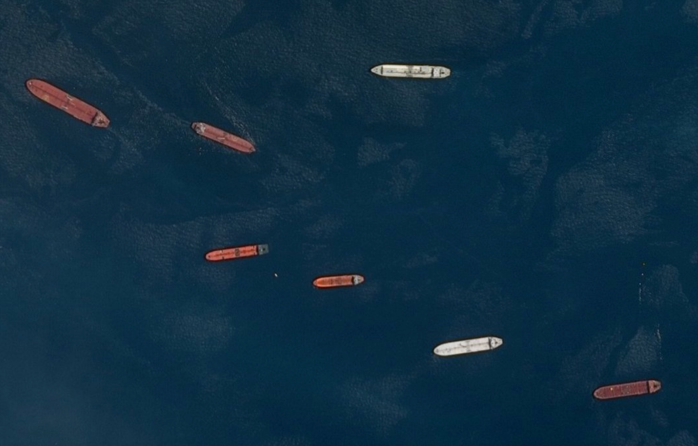 

데이터셋은 아래 웹사이트에서 다운로드받을 수 있습니다
- https://www.kaggle.com/c/airbus-ship-detection/data

(*Hint*: Kaggle의 Notebook이나 Discussion에 수많은 레퍼런스 코드와 팁들이 있습니다.)

데이터셋 크기는 약 28GB로 768px x 768px 해상도의 훈련 이미지들과 각 이미지에서 선박들의 위치를 알려 주는 마스크 정보가 포함되어 있습니다. 일부 이미지에는 선박이 포함되어 있지 않으며, 일부 이미지에는 여러 선박들이 포함될 수 있습니다. 이미지 내 및 이미지에 걸친 선박은 크기가 다를 수 있으며 (때로는 상당히) 넓은 바다, 부두, 정박지 등에 있습니다. 이런 다양한 선박 정보를 효율적으로 표현하기 위해 Ground truth 레이블링 데이터인 마스크 정보는 RLE(Run-Length Encoding)으로 인코딩되어 있습니다.

Airbus 데이터 과학자들은 이 문제를 두 가지 단계를 거치는 것이 도움이 된다는 것을 깨달았습니다.

1. 원본 이미지에서 노이즈를 제거하고 "마스크"또는 이미지의 최소한의 표현만 고려합니다. 이 "마스크"(아래 중앙 이미지)는 ML을 사용하여 출력으로 예측한 것입니다.
2. 예측 마스크 주위에 경계 상자(bounding box)를 그립니다.

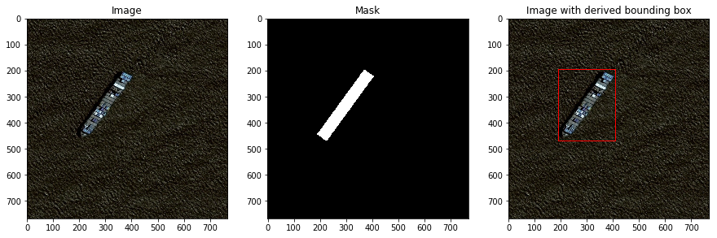 

## Image Classification vs. Detection vs. Segmentation

단순히 선박의 유무나 선박 개수같은 Image Classification 모델로 훈련해도 되지만, 좀 더 도전적인 팀은 각 선박의 픽셀 단위 정보를 온전하게 예측할 수 있는 Image Segmentation 모델로 훈련할 수 있습니다. Segmentation에 대한 배경 지식이 전혀 없다면 아래 그림을 참조해 주세요.

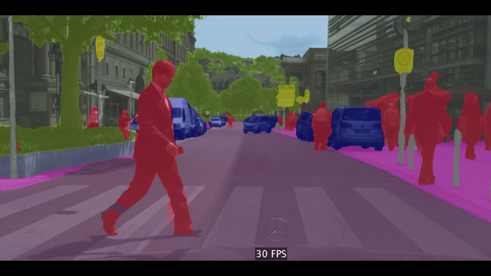 
상기 그림에서 사람, 차량, 표지판, 도로, 건물 및 하늘이 각각 픽셀 단위로 "분할"되고 각 개체의 색상이 다르다는 것을 알 수 있습니다. 물론, 선박 예측은 선박만 예측하는 단일 클래스 예측 문제이기 때문에 좀 더 쉽습니다.

Image Segmentation 훈련은 Mask R-CNN 모델을 먼저 고려해 보세요. 다만, Image Segmentation은 Mask R-CNN에 대한 배경 지식 이해와 두 종류의 정답 데이터(마스크, 경계 박스)가 필요하기 때문에, 절충안으로 경계 박스 정보만 필요한 Object Detection 문제로 간소화할 수도 있습니다. 

### What you are up against...

팀의 목표는 다양한 이미지들을 통해 ML 모델의 일반화(generalization) 기능을 평가하는 것이며, 아래 상황들과 같이 예측이 어려운 경우에 중점을 두고 다양한 상황에서 모델 성능을 평가합니다

* 선박 근처에 구름 존재

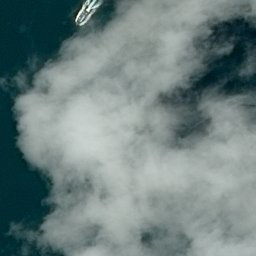 

* 안개 또는 얇은 구름 아래에있는 선박의 존재.

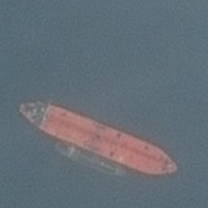 

* 배 뒤에 큰 항적 존재 (배의 일부로 간주되지 않음)

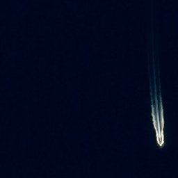 

* 정박지 내 개인 선박 식별 (해안 및 부두에 대한 오경보율-false alarm- 감소 필요)

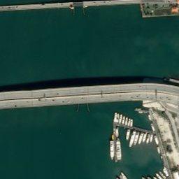 

* 해상 태양 반사로 인해 어려운 경우

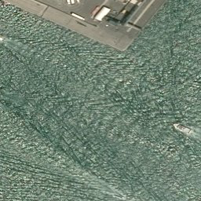 
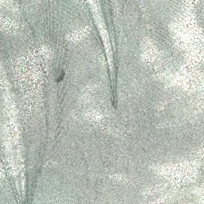 

* 바람으로 인한 파도와의 혼동

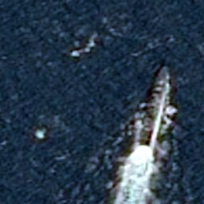 

* 이미지에서 부분적으로만 표시되는 선박 (이 경우 경계 상자가 잘릴 수 있음). 다양한 선박 크기 (초소형 레저 선박에서 대형 탱커까지).

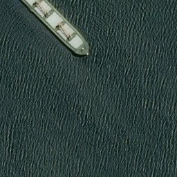 

* 두 척 이상의 선박이 결합된 경우 개별 선박 분리

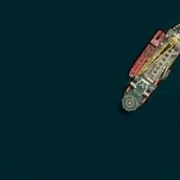 

* 부표(buoys), 바지선, 풍력 터빈 등과 같은 다른 떠다니는 물체와 분리 필요

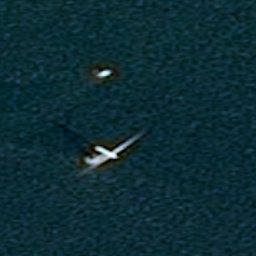 

## Get Started

### Starter Code
* Kaggle Baseline U-Net Model: https://www.kaggle.com/kmader/baseline-u-net-model-part-1

### Tips

#### Pre-processing
경계 박스 데이터가 주어져 있지 않기 때문에 마스크 픽셀 좌표를 기반으로 경계 박스를 계산하는 작업을 수행하세요. 최상단 좌측의 마스크 픽셀 좌표와 최하단 우측의 마스크 픽셀 좌표로 알아낼 수 있습니다. 그리고 Data Augmentation 기법도 적극 활용해 보세요.

#### Modeling
처음부터 커스텀 모델링을 수행해 보셔도 좋지만, baseline으로 SageMaker built-in Object Detection을 사용해 보세요. built-in Object Detection은 SSD(Single Shot Multibox Detector) 아키텍처를 사용하고 있으며 base 네트워크로는 VGG와 ResNet이 사용 가능합니다. 또한, 기 훈련된(pre-trained) 모델로 전이 학습을 수행하는 것을 추천합니다. 

#### Deployment
Amazon SageMaker를 사용하신다면 수많은 배포(deployment) 핸즈온들이 있습니다. 아래 핸즈온들을 검토해 보세요.

## References

* https://www.itm-conferences.org/articles/itmconf/pdf/2017/04/itmconf_ita2017_05012.pdf
* https://www.kaggle.com/c/airbus-ship-detection/data
* https://doi.org/10.1117/1.JRS.11.042611
* https://arxiv.org/pdf/1411.4038.pdf
* https://thehonestanalytics.com/automatic-identification-systems-market-2018-global-industry-analysis-by-key-players-segmentation-trends-and-forecast-by-2023/

 

[Privacy](https://aws.amazon.com/privacy/) | [Site terms](https://aws.amazon.com/terms/) | © 2020, Amazon Web Services, Inc. or its affiliates. All rights reserved.